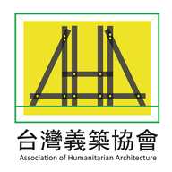

構築 
*構築* 
**構築** 
~~構築~~ 

>這裡是開頭引言 
>`基地環境氣候資料`：http://www.aha.tw/ 
>`氣象觀測歷史紀錄`：http://www.aha.tw/ 
>這裡是引言結束 

構築再來 

# 構築
## 構築
### 構築
#### 構築
##### 構築
###### 構築

結尾兩個空白鍵，代表換行  
是真的!!  

開始做說明:有序列表
1. 介紹
2. 工序  
   1. 第一天(前面空三行，數字就會變子序列)
   2. 第二天  
   3. 第三天  
   4. 第四天  
3. 工法
4. 工具
5. 材料

開始做說明:無序列表  
* 重點一
* 重點二
* 重點三
  * 詳細說明一(前面空兩行，黑點就變白)
  * 詳細說明二
* 重點四 
  >+ 他在說什麼 
  >- 他在說什麼
  >* 他在說什麼
* 重點五

構築說明  
1. 介紹
2. 工序
   1. 人力
   2. 工具
   3. 材料
   4. 工法
   5. 圖面
3. 建造方法方法
4. 生活合作方法
5. 施工手冊  
   1. - [x] 平面圖  
   2. - [x] 立面圖  
   3. - [ ] 剖面圖  
   4. - [x] 大樣圖  
   5. - [ ] 透視圖

試試看超連結  
http://www.aha.tw/   
[AHA](http://www.aha.tw/)  
  
  
  
  
  
  
  
